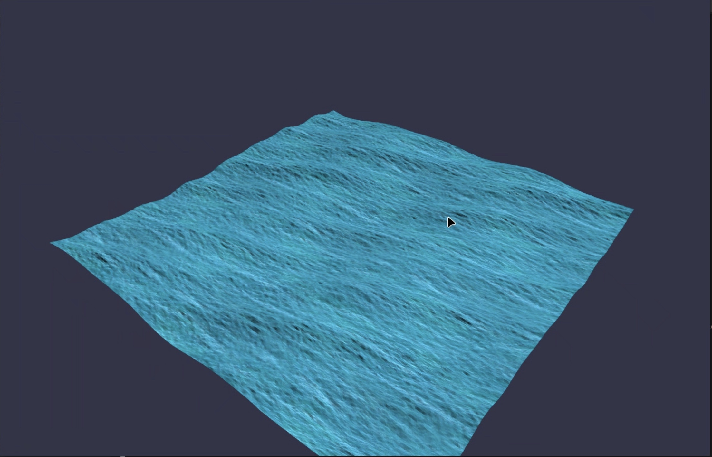

## Demo

There are two sources (camera.cpp and L21.cpp) and some header files.
Overview:
L21.cpp loads the texture (loadMyTexture function), sets the uniforms (setMyShaderUniforms function), and draws the plane mesh. The textures are divided by a factor to reduce scale. 
The planeMeshQuads function pushes the values into an interleaved array
that has the format v_x,v_y,v_z,n_x,n_y,n_z. Interleaved array is being used for easy specification of layout in VBO.
Texture parameters were declared to handle the cases when uv is not in range [0-1].

camera.cpp contains the code for camera controls. The position are calculated using spherical coordinates. To prevent gimball lock, phi angle is clamped

Shaders: 
The shaders are in files CG3.vertexshader, CG3.tcs, CG3.tes, and CG3.fragmentshader. 
Tessellation shaders tessellates the mesh. Geometry shader samples the displacement map and modifies the vertices (Displacement and Gerstner). It uses the modelspace positions received from TES. Gerstner function computes the vertex modifications (4 waves have been used). 
Geometry shader also calculates the normals.
Phong like shading is used to color the mesh, and the base color is derived from the provided texture file. 

Cam Controls:
Globe movement camera. Up and Down arrow key to adjust radius. Use click and drag to rotate around.

Dependencies:
GLEW 
OpenGL 
GLFW 
GLM
C++11

Building:
Can be built using the Makefile.
Open the Makefile. If GLM headers are in your PATH environment variable, remove the -I/home/tirzak/Downloads/glm
Else, update the path in the -I/home/tirzak/Downloads/glm, to point to the GLM headers location in your machine.
Following command can be used to build with Makefile: (Assuming you are in the directory with Makefile, and your platform is Linux):

make

To run:
The Assets directory must be present in the same location as the Assignment6.out file.
You can specify width and height in the command line.
Example:
./waves.out 

Example with screenW and screenH:
./waves.out 800 800

Or, you can just compile it manually. All of the sources need to be compiled. So, something like 
g++ camera.cpp L21.cpp -std=c++11 (Include/link libraries for the dependencies here) -o Assignment6.out
